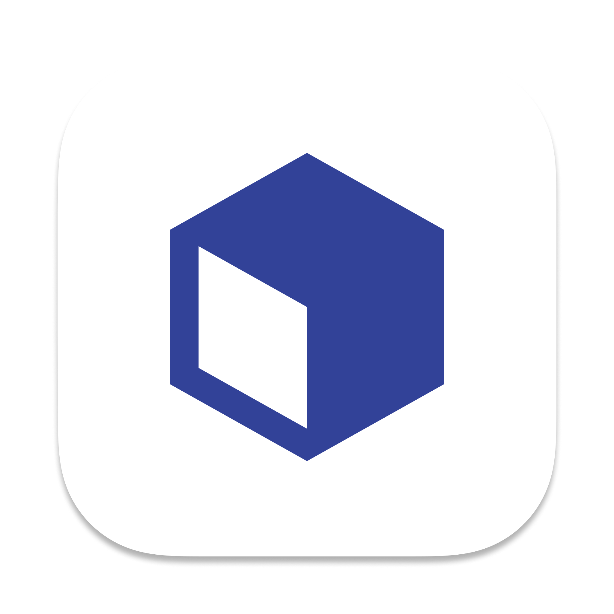
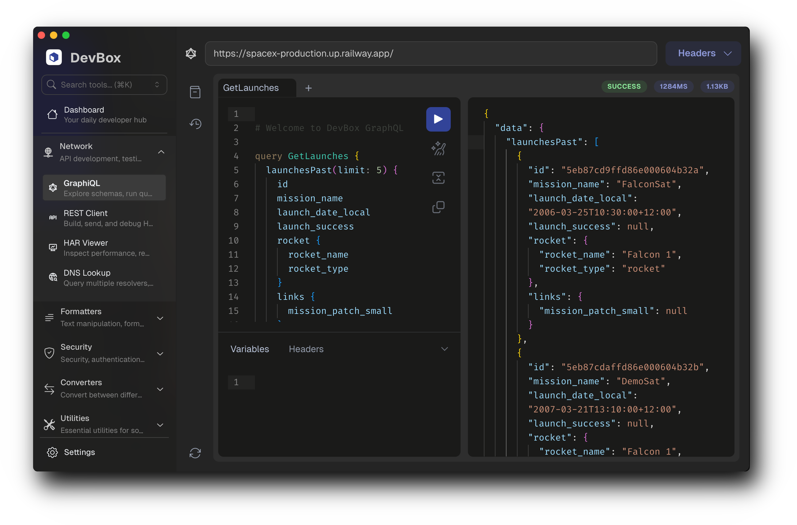

# Devbox

<p align="center">
  
</p>

<p align="center"><strong>All your everyday developer tools in one fast desktop app</strong></p>
<p align="center">Devbox is a lightweight, cross‑platform desktop and web app built with Tauri (Rust) and React that bundles everyday developer utilities into a single, streamlined experience. No clutter, no browser tabs — just the tools you need, available offline and optimized for productivity.</p>

<p align="center">
  
</p>

### Overview

Devbox helps you work faster by centralizing common developer workflows: inspect JWTs, test REST and GraphQL APIs, format JSON, explore regex, decode certificates, parse cron, and more. The dashboard surfaces frequently used tools and lets you customize the sidebar so your favorites are one click away.

### Highlights

- **Cross‑platform desktop**: Powered by Tauri for a small footprint and native performance.
- **Web app**: Use it in the browser with a fast Vite dev server and static build.
- **Productivity‑first UI**: Reorder tools, hide what you don’t use, group them modules and get to work quickly.
- **Dashboard**: See recently used tools and follow your own RSS feeds.
- **Offline‑friendly**: Most tools work entirely locally; network tools only connect when you use them.
- **No fluff / no filler**: Only tools developers actually reach for daily—focused, fast, and maintained (no novelty widgets).

### Installation

> Binaries will be published with the first public release. Paths below are placeholders until then.

Download the latest release for your platform from the (upcoming) [GitHub Releases page](https://github.com/your-org/devbox/releases)

After installing, launch Devbox and start using tools immediately—no sign‑in, anonymous usage counts stored locally.

### Available Tools

#### Network

- GraphiQL – Explore schemas, run queries, debug responses
- REST Client – Compose & send HTTP requests
- HAR Viewer – Inspect performance waterfalls & request details
- DNS Lookup – Query records across resolvers

#### Security

- JWT Tools – Decode & inspect JSON Web Tokens
- HMAC Generator – Compute signatures (Web Crypto)
- Certificate Decoder – Parse X.509 certificates / CSRs
- Hashing Text – Compute hashes for input text
- SSH Keys – Generate & validate SSH key pairs

#### Utilities

- Timezone – Multi‑zone time scrubber with persistence
- Regex Tester – Live highlighting & match exploration
- Cron – Build, parse, and preview cron expressions
- Bundle Analyzer – Inspect npm package size & exports

#### Generators

- Stateless Password – Deterministic site passwords (no storage)
- QuickType – Generate types / interfaces from JSON
- Data Faker – Mock data from schema or visual builder
- ID Generator – UUID, NanoID, custom patterns

#### Viewers

- Markdown – Live preview & export
- Diff – Monaco diff for text / JSON / code
- SVG Preview – Inspect & optimize SVG
- HTML/CSS Preview – Live HTML playground

#### Formatters

- JSON Formatter – Pretty print & tree explorer
- SQL Formatter – Format SQL queries
- JS/TS Minifier – Minify JavaScript / TypeScript
- CSS Minifier – Minify CSS
- HTML Minifier – Minify HTML

#### Converters

- JSON ⇄ YAML – Bi‑directional conversion
- Backslash Escape – Escape / unescape sequences
- URL Parser – Parse & edit URL components
- URL Encoder – Encode / decode URLs
- Base64 – Encode / decode text
- Epoch Converter – Epoch ↔ human time

> Planned: WebSocket Client, Mock API Server / Webhook tester.

## Getting Started

### Desktop (Tauri)

1. Install dependencies:

```bash
  yarn install
```

2. Start the desktop app:

```bash
  yarn start
```

Access app from the browser at `http://localhost:3001`

## Build

### Static web build

```bash
  yarn build
```

### Desktop (Tauri) build

```bash
  yarn tauri build
```

### Inspiration

Devbox draws conceptual inspiration from modern multi‑tool developer workbenches. Special thanks to:

- **devtools-x** – For pioneering the idea of a cohesive, high‑performance toolbox and influencing early architectural choices (sidebar ergonomics, and tech stack direction).
- **devutils** – For further inspiration on focused, single‑purpose utility design and polished UX details.

Devbox builds on those ideas with a unified dashboard (usage‑aware surfacing + RSS), stronger module abstraction, no filler tools and an offline‑first Tauri desktop focus.

## Contributing

We welcome contributions! We're especially looking to improve:

- **UX / UI polish** – Interaction flow, keyboard shortcuts, accessibility, visual consistency, dark/light contrast.
- **Performance** – Faster startup, smaller bundle size, memory efficiency, render minimization.
- **Essential new tools** – Only high‑signal utilities devs actually use daily (no novelty / filler). Open an issue first to discuss scope & fit.
- **Cross‑platform parity** – macOS, Linux, Windows nuances (menus, drag regions, file dialogs, notifications).
- **Module quality** – Better defaults, validation, helpful empty states, clearer errors.
- **Documentation** – Usage tips, adding a new tool module, troubleshooting.

Before implementing a new tool, please file an issue describing: the problem it solves, expected users, overlap with existing tools, and proposed module placement. We bias toward depth & quality over breadth.

To run locally, follow the [Getting Started](#getting-started) section (clone → `yarn install` → `yarn start`). Web build also runs from the same dev server.

Bug reports, focused PRs, profiling traces, and thoughtful design discussions are all appreciated.
